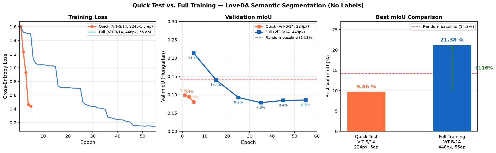

# Unsupervised Semantic Segmentation for Remote Sensing

Transfer learning with pseudo-labels and self-training for semantic segmentation of Earth observation imagery **without any manual annotation**.

> **Report:** [docs/report.md](docs/report.md) · [REPORT.pdf](REPORT.pdf) — full methodology, results, and figures (26 May 2026)

## Documentation

| Page | Description |
|------|-------------|
| [Installation](docs/installation.md) | Environment setup, CUDA versions |
| [Quick Start](docs/quickstart.md) | Download data, train, evaluate |
| [Architecture](docs/architecture.md) | DINOv2 + SegFormer + Mean Teacher |
| [Training](docs/training.md) | Pipeline, config reference, hardware |
| [Evaluation](docs/evaluation.md) | Hungarian matching, metrics |
| [Datasets](docs/datasets.md) | LoveDA and Sentinel-2 |

## Results



### Quick test vs. Full training

| | Quick Test | Full Training |
|---|---|---|
| Backbone | ViT-S/14 | **ViT-B/14** |
| Resolution | 224 px | **448 px** |
| K-means vectors | 645 632 (d=384) | **2 582 528 (d=768)** |
| Warm-up | 1 epoch | **5 epochs** |
| Self-training | 2 rounds × 2 ep | **5 rounds × 10 ep** |
| Threshold θ | 0.70 (fixed) | **0.95 → 0.85** |
| Training time | ~10 min | **2 h 18 min** |
| Loss (start → end) | 1.60 → 0.44 | **1.60 → 0.15** |
| **Best val mIoU** | **9.86 %** | **21.38 % (+116 %)** |

### Full training dynamics (ViT-B/14, 448 px, 55 epochs)


| Stage | Epochs | Train Loss | Val mIoU | Confident px |
|-------|--------|------------|----------|--------------|
| Warm-up | 5 | 1.60 → 1.50 | **21.38 %** | — |
| Round 1 (θ=0.95) | 10 | 1.13 → 1.02 | 14.05 % | 0.0 % |
| Round 2 (θ=0.93) | 10 | 0.74 → 0.70 | 9.25 % | 0.0 % |
| Round 3 (θ=0.90) | 10 | 0.50 → 0.40 | 7.83 % | 12.6 % |
| Round 4 (θ=0.88) | 10 | 0.28 → 0.21 | 8.44 % | 59.3 % |
| Round 5 (θ=0.85) | 10 | 0.16 → 0.15 | 8.56 % | 82.9 % |
| **Best** | — | — | **21.38 %** | — |

> Best result achieved after warm-up. High initial threshold (θ₀=0.95) disabled consistency loss for rounds 1–2; lower θ₀=0.80–0.85 recommended for future runs.

## Quick Start

```bash
make env-gpu    # create conda env (CUDA 13.2)
make download   # download LoveDA (~6 GB)
make train-gpu  # ViT-B/14, 448 px, full training
make eval       # evaluate with Hungarian matching
```

## Architecture

```
Input → ChannelAdapter → DINOv2 ViT (frozen) → SegFormer MLP Decoder → Logits
                                ↕ EMA
                         Mean Teacher
```

Backbone: `dinov2_vits14` / `vitb14` / `vitl14` · Decoder: 4-scale MLP head · Teacher: EMA α=0.999

## Supported Datasets

| Dataset | Bands | Resolution | Classes |
|---------|-------|------------|---------|
| [LoveDA](https://github.com/Junjue-Wang/LoveDA) | RGB (3) | 0.3 m/px | 7 |
| Sentinel-2 | Multispectral (13) | 10–60 m | configurable |

## References

- [DINOv2 — Oquab et al. 2023](https://arxiv.org/abs/2304.07193)
- [LoveDA — Wang et al. 2021](https://arxiv.org/abs/2110.08733)
- [Mean Teacher — Tarvainen & Valpola 2017](https://arxiv.org/abs/1703.01780)
- [SegFormer — Xie et al. 2021](https://arxiv.org/abs/2105.15203)
