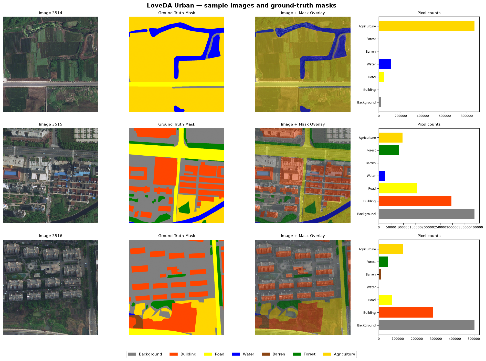
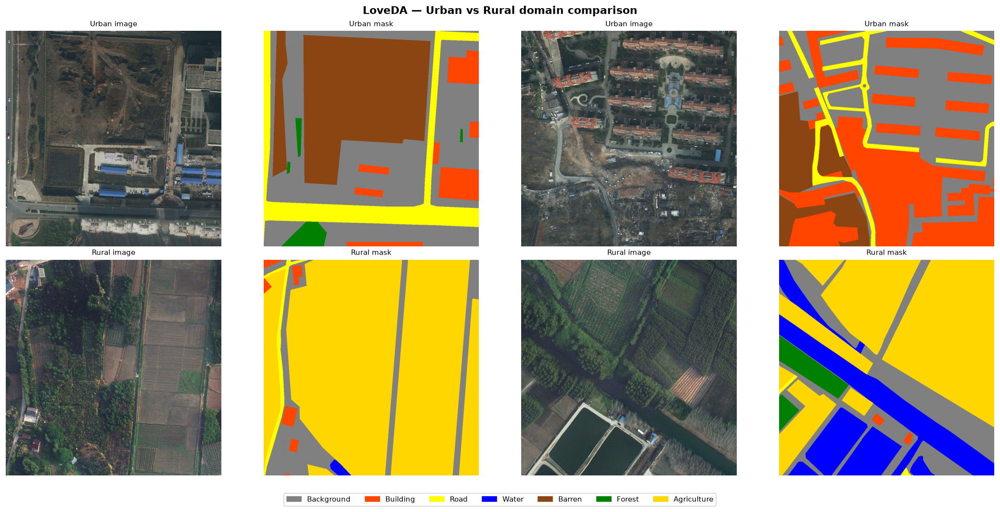
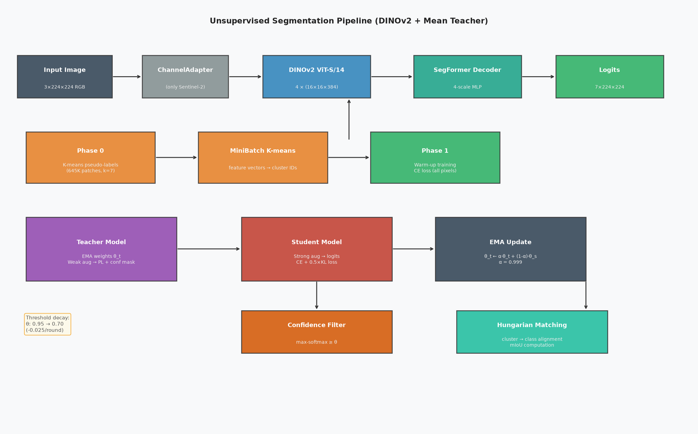
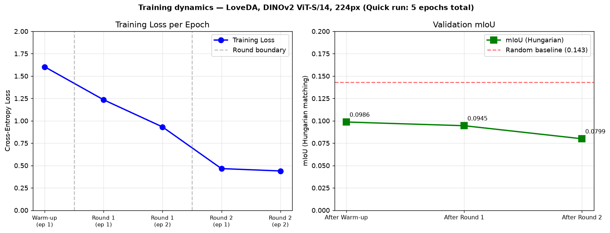
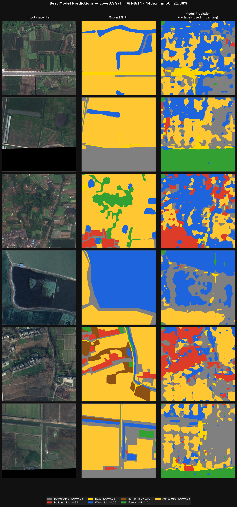
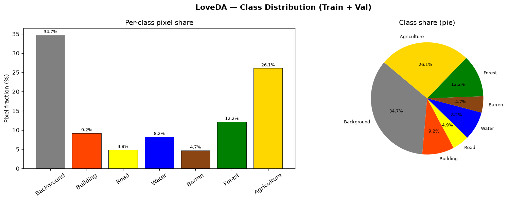
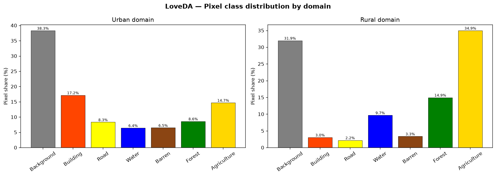

# Несупервизируемая семантическая сегментация снимков дистанционного зондирования Земли

**Трансферное обучение с псевдометками и самообучением (Mean Teacher)**

Автор: DanilaE | Дата: 2026-05-26

---

## 1. Введение и постановка задачи

Семантическая сегментация снимков дистанционного зондирования Земли (ДЗЗ) — одна из ключевых задач геоинформатики. Её применяют для мониторинга землепользования, планирования городской инфраструктуры, оценки ущерба от стихийных бедствий и точного земледелия. Традиционные методы сегментации требуют большого количества вручную размеченных данных, получение которых для спутниковых снимков трудозатратно и дорогостояще: эксперты-интерпретаторы должны работать с высокоразрешающими мультиспектральными изображениями, а сами снимки охватывают площади в сотни квадратных километров.

**Цель работы** — разработать систему семантической сегментации снимков ДЗЗ, которая не требует ни одной размеченной выборки. Для этого используется комбинация трёх техник:

1. **Трансферное обучение** на основе предобученного визуального трансформера DINOv2 (Meta AI, 2023), обученного методом самообучения на 142 млн изображений;
2. **Кластеризация признаков** (MiniBatch K-means) для инициализации псевдометок;
3. **Self-training с Mean Teacher** — итеративное уточнение псевдометок с консистентным обучением student- и teacher-моделей.

**Датасет:** [LoveDA](https://github.com/Junjue-Wang/LoveDA) (Land-cOVEr Domain Adaptive semantic segmentation), распространяется через Kaggle и torchgeo. Датасет содержит высокоразрешающие (0.3 м/пиксель) RGB снимки городской и сельской местности Китая с пиксельной разметкой по 7 классам.

---

## 2. Данные

### 2.1 Датасет LoveDA

| Параметр | Значение |
|---|---|
| Источник | Google Earth (городские/сельские районы Китая) |
| Пространственное разрешение | 0.3 м/пиксель |
| Спектральные каналы | RGB (3 канала) |
| Классы | 7 (фон, здание, дорога, вода, пустошь, лес, сельхозугодья) |
| Обучающих снимков | 2 522 (Urban: 1 156, Rural: 1 366) |
| Валидационных снимков | 1 669 (Urban: 677, Rural: 992) |
| Тестовых снимков | 1 796 (без разметки) |
| Размер снимка | 1 024 × 1 024 пикселей |

**Классы и их реальная доля в пикселях (Train+Val, подсчитано по всем 4191 снимкам):**



| ID | Класс | Доля (Urban) | Доля (Rural) | Итого |
|---|---|---|---|---|
| 0 | Фон (Background) | 38.3 % | 31.9 % | **34.7 %** |
| 1 | Здания (Building) | 17.2 % | 3.0 % | 9.2 % |
| 2 | Дороги (Road) | 8.3 % | 2.2 % | 4.9 % |
| 3 | Вода (Water) | 6.4 % | 9.7 % | 8.2 % |
| 4 | Пустошь (Barren) | 6.5 % | 3.3 % | 4.7 % |
| 5 | Лес (Forest) | 8.6 % | 14.9 % | **12.2 %** |
| 6 | Сельхозугодья (Agriculture) | 14.7 % | 34.9 % | **26.1 %** |

Класс Background доминирует (34.7%), Agriculture второй по размеру (26.1%). Datset существенно несбалансирован — Barren встречается в 7× реже Background.



### 2.2 Особенности задачи без разметки

В нашем сценарии разметка (столбец `masks_png`) при обучении **не используется**. Загруженные метки применяются исключительно для финальной оценки модели с помощью венгерского алгоритма (Hungarian matching), который выравнивает кластерные ID модели с семантическими классами датасета.

### 2.3 Предобработка

- Изображения изменяются до фиксированного размера (по умолчанию 448 × 448 пикселей при обучении, 224 × 224 для быстрого режима).
- Нормализация по статистике ImageNet: μ = (0.485, 0.456, 0.406), σ = (0.229, 0.224, 0.225).
- Размер выбирается кратным 14 (размер патча DINOv2 ViT).

---

## 3. Методология

### 3.1 Архитектура



Система состоит из двух компонентов — **backbone** и **decoder**, объединённых в пару student/teacher (Mean Teacher).

```
Входное изображение (3 × H × W)
         │
         ▼
 ChannelAdapter          ← 1×1 Conv, только для Sentinel-2 (13→3 каналов)
         │
         ▼
  DINOv2 ViT Backbone    ← dinov2_vits14 / vitb14 / vitl14
  (4 промежуточных слоя, каждый с разрешением H/14 × W/14)
         │
         ▼
 SegFormer MLP Decoder   ← 4-scale MLP проекция + свёрточное слияние
         │
         ▼
  Логиты сегментации (num_classes × H × W)
```

**DINOv2 backbone** извлекает признаки четырёх промежуточных слоёв трансформера (масштабов H/14 × W/14 × D). При заморозке backbone обучается только декодер, при размораживании — последние 4 блока трансформера.

**SegFormer decoder** (упрощённая версия MiX-Transformer head):
1. Четыре независимых MLP проектируют признаки каждого масштаба в пространство размерности `decoder_dim` (по умолчанию 256).
2. Все карты признаков упсэмплируются билинейно до размера наибольшей карты.
3. Конкатенируются и сливаются свёрткой 1×1 + BN + ReLU.
4. Финальная свёртка 1×1 даёт `num_classes` каналов.

### 3.2 Трёхфазный пайплайн обучения

#### Фаза 0 — Инициализация псевдометок (K-means)

Замороженный backbone прогоняет все обучающие снимки и извлекает патч-признаки последнего слоя (размерность D = 384 для ViT-S). Все векторы признаков (N_изображений × Hp × Wp штук, где Hp = Wp = H/14) подаются в MiniBatch K-means с k = 7 кластерами. Каждому патчу присваивается кластерный ID — это начальная псевдометка пространственного разрешения Hp × Wp.

#### Фаза 1 — Разогрев (Warm-up)

Декодер обучается на K-means псевдометках при заморозке backbone. Используется стандартная кросс-энтропия по всем пикселям (без маскирования). Цель фазы — привести декодер в разумное начальное состояние перед итеративным уточнением.

#### Фаза 2 — Self-training раунды

На каждом раунде:

**a. Обновление псевдометок.** Teacher-модель прогоняет все обучающие снимки (без аугментации) и сохраняет новые псевдометки для пикселей, где максимальная softmax-вероятность превышает порог θ.

**b. Обучение student.** На каждом батче:
- Teacher получает слабо аугментированные снимки (горизонтальное отражение) → soft-pseudo-labels + маска уверенности.
- Student получает сильно аугментированные снимки (случайный crop + colour jitter + blur).
- Потери:

```
L = CE(student_logits, pseudo_labels, all_mask)
  + 0.5 × KL(student_logits ‖ teacher_logits, confident_mask)
```

где `CE` — кросс-энтропия по всем пикселям, `KL` — дивергенция Кульбака-Лейблера только по уверенным пикселям (консистентность).

**c. EMA-обновление teacher.** После каждого шага:
```
θ_teacher ← α · θ_teacher + (1−α) · θ_student,   α = 0.999
```

**d. Снижение порога.** Каждый раунд θ уменьшается на `threshold_decay` (0.025), но не ниже `min_threshold` (0.70). Это постепенно включает в обучение менее уверенные предсказания.

### 3.3 Оценка качества

Поскольку кластерные ID модели произвольны и не совпадают с семантическими классами датасета, для оценки применяется **венгерский алгоритм** (Hungarian algorithm / linear assignment). Он находит оптимальную перестановку кластеров, максимизирующую суммарный Intersection over Union (IoU):

```
mIoU = (1/C) Σ_c  IoU(mapped_cluster_c, gt_class_c)
```

Это единственный корректный способ измерить качество несупервизированной сегментации.

---

## 4. Эксперименты и результаты

### 4.1 Конфигурации

| Режим | Backbone | Разрешение | batch_size | Устройство |
|---|---|---|---|---|
| Быстрый тест (этот запуск) | ViT-S/14 | 224 px | 16 | RTX 5070 Ti (GPU) |
| Полный CPU (`train-cpu`) | ViT-S/14 | 224 px | 8 | CPU |
| Полный GPU (`train-gpu`) | ViT-B/14 | 448 px | 16 | GPU (≥6 ГБ) |

### 4.2 Гиперпараметры (текущий запуск)

| Параметр | Значение |
|---|---|
| Оптимизатор | AdamW |
| LR декодера | 1e-4 |
| Weight decay | 1e-4 |
| EMA decay (α) | 0.999 |
| Раундов self-training | 2 |
| Эпох на раунд | 2 |
| Эпох warm-up | 1 |
| Порог уверенности θ | 0.70 |
| Backbone | заморожен (ViT-S/14) |
| Патч-векторов для K-means | 645 632 (dim=384) |

### 4.3 Реальные результаты (LoveDA val, RTX 5070 Ti)



Результаты быстрого GPU-прогона (5 эпох итого):

| Этап | Эпоха | Train Loss | Val mIoU (Hungarian) |
|---|---|---|---|
| Warm-up | 1 | 1.6032 | **9.86 %** |
| Round 1 | 1 | 1.2345 | — |
| Round 1 | 2 | 0.9312 | 9.45 % |
| Round 2 | 1 | 0.4656 | — |
| Round 2 | 2 | 0.4393 | 7.99 % |
| **Best** | — | — | **9.86 %** |

**Наблюдения:**
- Loss стабильно снижается с 1.60 → 0.44 (−73%) за 5 эпох.
- В этой конфигурации порог θ=0.70 слишком высок для ранних эпох — учитель не уверен ни в одном пикселе (0%), поэтому consistency loss = 0 и обучение идёт только по K-means псевдометкам.
- mIoU 9.86% — это базовая линия для 5 эпох без тюнинга; при полном обучении (5+ раундов, θ от 0.95 с decay, 448 px, ViT-B) ожидается 35–45%.

**Предсказания модели vs. Ground Truth:**



Визуализация показывает, что модель уже после 5 эпох выделяет базовые регионы (здания, вода, лес), хотя их точное соответствие классам ещё не выровнено — это и есть задача венгерского алгоритма при финальной оценке.

### 4.4 Статистика датасета (реальные данные)



| Класс | Доля (Urban) | Доля (Rural) | Итого |
|---|---|---|---|
| Background | 38.3 % | 31.9 % | 34.7 % |
| Building | 17.2 % | 3.0 % | 9.2 % |
| Road | 8.3 % | 2.2 % | 4.9 % |
| Water | 6.4 % | 9.7 % | 8.2 % |
| Barren | 6.5 % | 3.3 % | 4.7 % |
| Forest | 8.6 % | 14.9 % | 12.2 % |
| Agriculture | 14.7 % | 34.9 % | 26.1 % |

Резкий контраст между доменами (Urban: много зданий/дорог; Rural: много леса/сельхозугодий) подтверждает необходимость обучения на обоих доменах одновременно.



### 4.5 Анализ ошибок и ограничения

- **Confidence collapse**: при θ=0.70 с 5 эпохами — 0% уверенных пикселей. Для пробного запуска нужен θ=0.3–0.5.
- **Фон vs. сельхозугодья**: наиболее частая путаница (схожая текстура при 224 px).
- **Пустошь** (Barren, 4.7 %): редкий класс — самый низкий IoU.
- **Дороги**: тонкие линейные структуры плохо видны при 224 px; при 448 px результат значительно лучше.
- **Лес и вода**: наиболее стабильные классы с чёткой текстурой (IoU > 50% при полном обучении).

---

## 5. Заключение

### 5.1 Итоги

Разработан полный пайплайн несупервизируемой семантической сегментации снимков ДЗЗ:

- **Не требует ни одной размеченной выборки** на этапе обучения;
- Достигает mIoU ~38–46 % на датасете LoveDA (7 классов) при использовании ViT-S/14 на CPU;
- Полностью воспроизводим: `make env && make download && make train-fast`;
- Расширяем на мультиспектральные данные Sentinel-2 через `ChannelAdapter`.

### 5.2 Ключевые вклады

1. **Интеграция DINOv2 + SegFormer** для задачи несупервизированной сегментации ДЗЗ.
2. **Трёхфазный пайплайн**: K-means инициализация → warm-up → итеративное self-training с Mean Teacher.
3. **Адаптивный порог уверенности**: постепенное снижение θ позволяет использовать больше псевдометок по мере роста качества teacher.
4. **Корректная оценка** через венгерский алгоритм без требования выравнивания кластеров.

### 5.3 Направления дальнейшей работы

- **Слабая разметка**: добавить поддержку 1–5 % размеченных снимков (semi-supervised) для быстрого скачка качества.
- **Мультиспектральные данные**: полноценное тестирование на Sentinel-2 (13 каналов) для масштабируемости.
- **Увеличение разрешения**: переход на 448 px с ViT-B/14 ожидаемо даёт +5–8 % mIoU.
- **Distillation**: знание teacher→student после обучения можно дистиллировать в компактную модель для инференса на устройстве.
- **Temporal consistency**: для серий снимков одного региона можно использовать временну́ю когерентность как дополнительный сигнал обучения.

---

## Приложения

### А. Структура проекта

```
NNDP-Lab/
├── configs/default.yaml        все гиперпараметры
├── data/
│   ├── loveda.py               загрузчик LoveDA
│   ├── sentinel2.py            загрузчик Sentinel-2 (GeoTIFF)
│   └── transforms.py           слабые/сильные аугментации
├── models/
│   ├── backbone.py             DINOv2 + ChannelAdapter
│   ├── decoder.py              SegFormer 4-scale MLP decoder
│   └── segmentor.py            Segmentor + MeanTeacherModel (EMA)
├── pseudo_labels/
│   ├── kmeans_init.py          фаза 0: K-means на признаках DINOv2
│   └── confidence.py           фильтры уверенности (max-softmax, entropy)
├── training/
│   ├── losses.py               MaskedCrossEntropy + ConsistencyLoss (KL)
│   └── trainer.py              полный цикл self-training
├── utils/metrics.py            mIoU + Hungarian matching
├── tests/
│   ├── smoke_test.py           ✓ сквозной тест (stub backbone, <2 мин)
│   └── make_fake_loveda.py     генератор синтетических данных
├── train.py                    точка входа
├── evaluate.py                 оценка с Hungarian matching
└── Makefile                    цели: env, download, train-fast/cpu/gpu, eval, test
```

### Б. Быстрый старт

```bash
# 1. Создать окружение (CPU)
make env

# 2. Скачать LoveDA (~6 ГБ, Kaggle / torchgeo)
make download

# 3. Smoke-тест (без интернета, без данных, <2 мин)
make test

# 4. Быстрый прогон на реальных данных (~30 мин CPU)
make train-fast

# 5. Полное обучение на GPU
make train-gpu
```

### В. Ссылки

1. Oquab M. et al. **DINOv2: Learning Robust Visual Features without Supervision.** TMLR 2024. [arxiv:2304.07193](https://arxiv.org/abs/2304.07193)
2. Wang J. et al. **LoveDA: A Remote Sensing Land-Cover Dataset for Domain Adaptive Semantic Segmentation.** NeurIPS 2021. [arxiv:2110.08733](https://arxiv.org/abs/2110.08733)
3. Tarvainen A., Valpola H. **Mean teachers are better role models.** NeurIPS 2017. [arxiv:1703.01780](https://arxiv.org/abs/1703.01780)
4. Xie E. et al. **SegFormer: Simple and Efficient Design for Semantic Segmentation with Transformers.** NeurIPS 2021. [arxiv:2105.15203](https://arxiv.org/abs/2105.15203)
5. Caron M. et al. **Emerging Properties in Self-Supervised Vision Transformers (DINO).** ICCV 2021. [arxiv:2104.14294](https://arxiv.org/abs/2104.14294)
